# MapGap User Story Visual Review

Date: July 5, 2026

Run context:
- Local app: `http://127.0.0.1:5175`
- Backend path: Vite `/api` proxy to `https://mapgap-access.netlify.app`
- Valhalla access: supplied through the environment when the deployment requires client access
- Command: `MAPGAP_VALHALLA_SECRET=<client-access-secret-if-required> npm run test:live`
- Result: 17 passed, including live Valhalla API checks and desktop, mobile, iPad portrait, iPad landscape, and desktop usability smoke checks.

## User Story Screenshot Panel

| Story | Viewpoint | Clicks | Evidence | Options and decision |
| --- | --- | ---: | --- | --- |
| 1. First run to generated heatmap | Desktop 1440x900 | 1 | 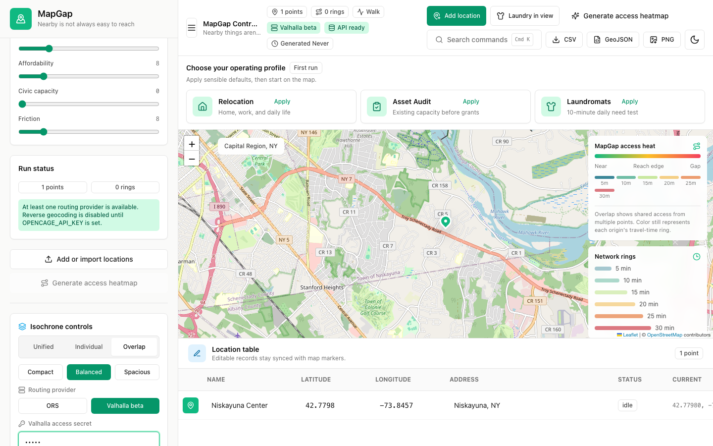 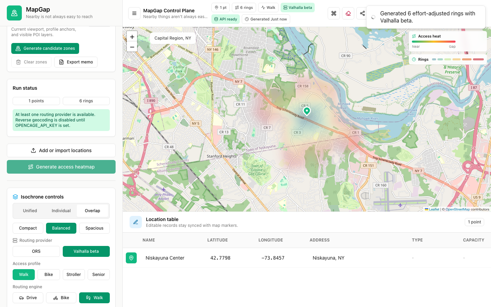 | Option A: keep the secret tucked into controls until needed, then make Generate persistent. Option B: add an inline "Valhalla ready - generate now" state below the secret. Option C: add a full first-run wizard. Decision: keep A now, add B next. Avoid C until profiles and candidate zones exist. |
| 2. Quickly add and edit locations | Desktop 1440x900 | 1 | 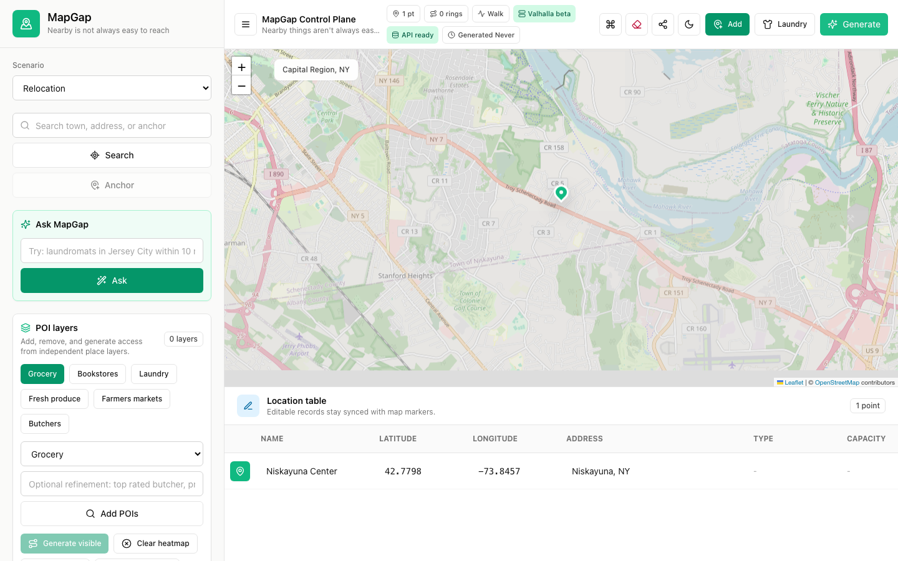 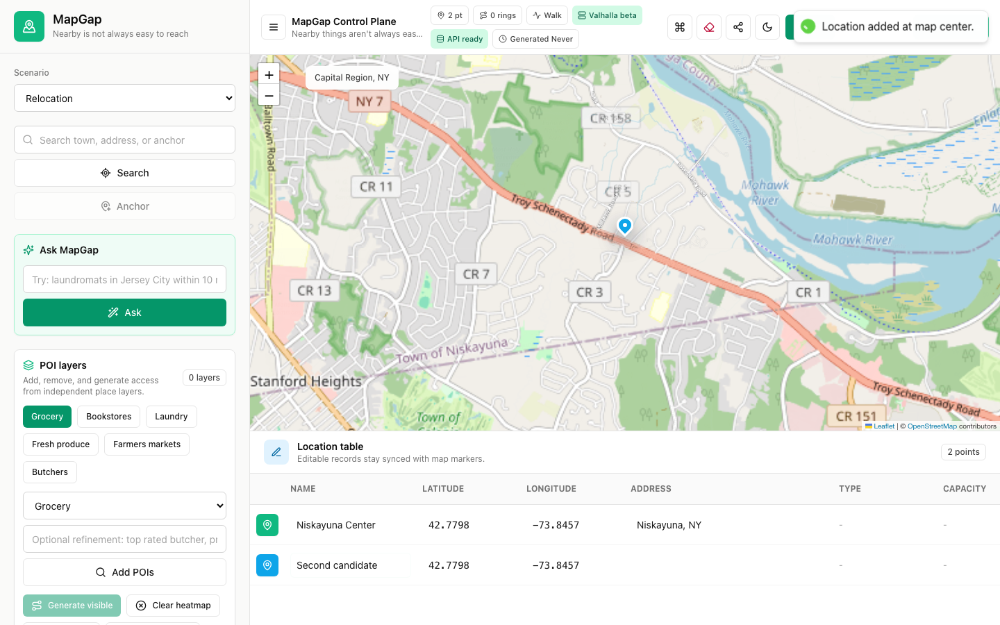 | Option A: topbar Add point at map center. Option B: map-level floating add button. Option C: profile-aware "Add anchor" form. Decision: A solves the current hunt. C is the right next product behavior because relocation users think in anchors, not anonymous points. |
| 3. Relocation profile review | Desktop 1440x900 | 0 | 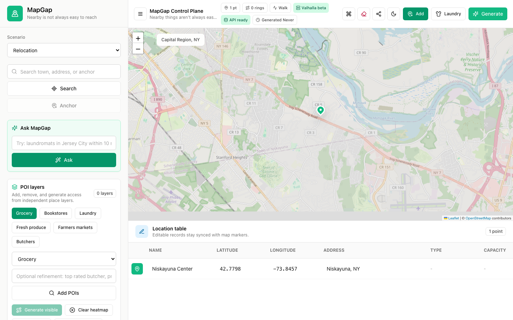 | Option A: keep the profile as a compact sidebar panel. Option B: guided profile wizard. Option C: collapsible scorecard drawer. Decision: keep A for operator demos, then introduce B for consumer relocation setup and C for post-analysis explanation. |
| 4. Dual-career scenario | Desktop 1440x900 | 1 | 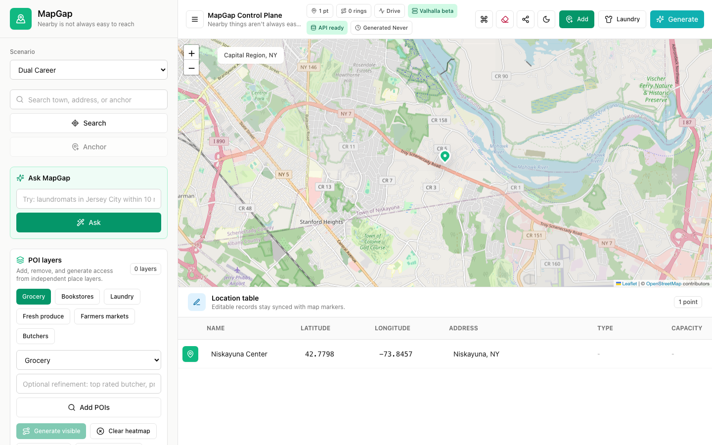 | Option A: scenario select menu. Option B: scenario cards. Option C: job-to-home candidate workflow. Decision: keep A for speed, but the next differentiator is C: show candidate zones where both commutes work. |
| 5. Mobile first run | Mobile 390x844 | 2 | 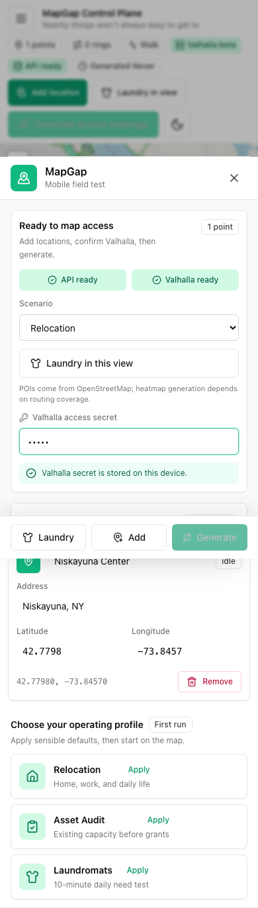 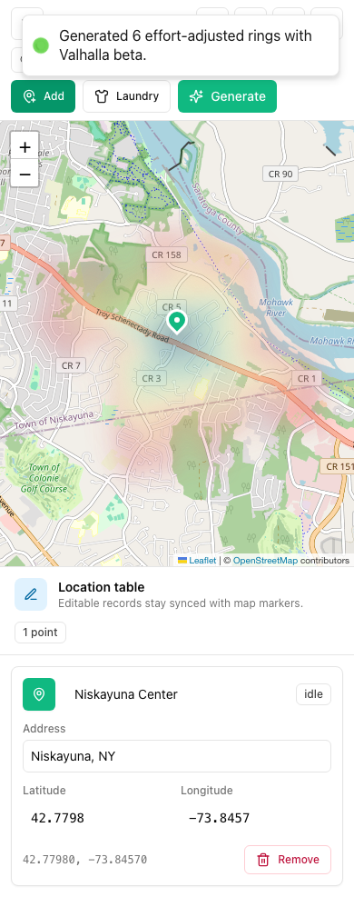 | Option A: drawer-first controls with Generate directly under the secret. Option B: inline secret prompt above the map. Option C: bottom action bar. Decision: A is acceptable now. Add C later for repeat use so primary actions stay thumb-reachable after the drawer closes. |
| 6. Export-ready evidence | Desktop 1440x900 | 1 | 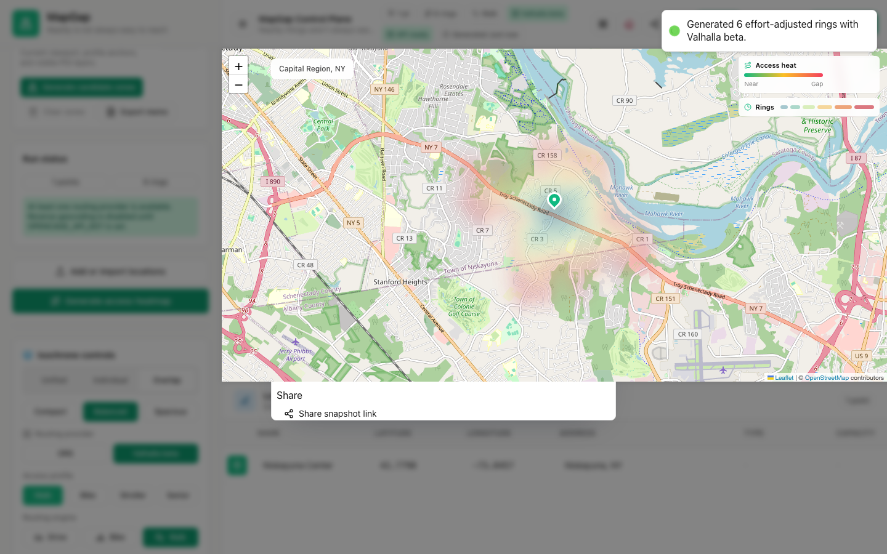 | Option A: keep raw CSV, GeoJSON, PNG exports. Option B: add "Decision memo" export. Option C: shareable project link. Decision: keep A, prioritize B before C because the congressional and civic story needs a concise evidence artifact. |
| 7. iPad map and controls balance | iPad portrait 820x1180 | 2 | 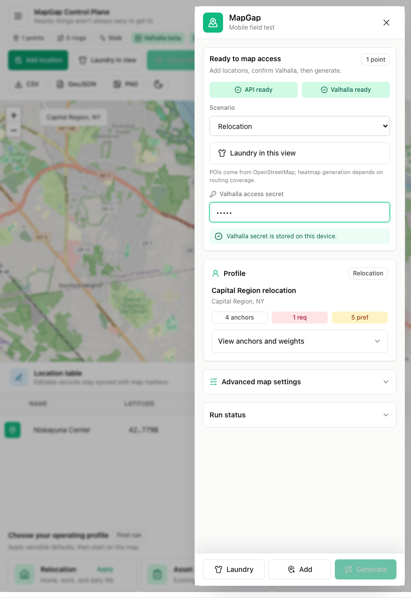 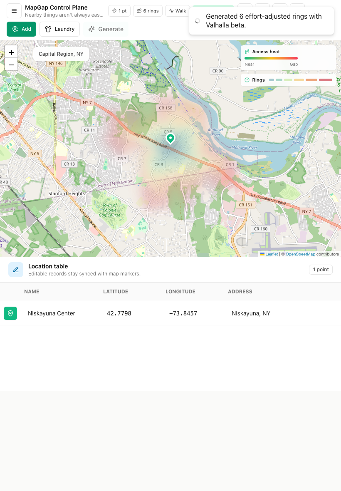 | Option A: reuse mobile drawer. Option B: responsive side sheet that leaves more map visible. Option C: split-pane tablet mode. Decision: A passes regression. B should be next; C is only worth it once profile editing becomes a frequent tablet workflow. |

## Overall Impression

MapGap now feels more intentional and usable than the earlier state because the high-frequency actions are visible at the moment of need. The single biggest remaining opportunity is to move from an operator map tool toward a guided decision workflow where each step answers "what should I do next?"

## Key Strengths

- The live-backed flow works end to end: the local app can generate real Valhalla rings through the published Netlify endpoint.
- The Valhalla secret no longer consumes first-load space unnecessarily, but once entered, Generate is visible in the desktop sidebar, desktop topbar, mobile drawer, and tablet drawer.
- Mobile, iPad portrait, and desktop avoid horizontal overflow in the tested states.
- The map remains the primary surface. Controls and profile details are present, but they do not replace the map on desktop.
- The topbar Add point action directly addresses the prior "hunt for the button" problem.
- The profile panel gives the relocation and dual-career concepts a concrete structure: anchors, constraints, and weights are now visible before deeper buildout.
- The historical river/water overlay artifact was not reproduced in the live screenshots. The current raster heat layer no longer shows the old hard compensation patch called out in the reference image.

## Main Issues & Friction Points

- The first-run flow still relies on the user understanding that "enter secret" enables generation. A visible "ready, now generate" cue is present through the button state, but the state transition is subtle.
- Add point creates an anonymous point at map center. This is useful for operators, but relocation users need "Add work anchor," "Add family anchor," "Add school," or "Add hospital" language.
- Editing is still table-first. The table is clear on desktop, but it is below the map and requires scrolling on mobile and iPad.
- The relocation profile is informative but dense. It is trying to serve as a preset summary, profile editor, and score explanation at the same time.
- Scenario cards are helpful, but the selected scenario does not yet produce candidate home zones, scorecards, or ranked next steps.
- Export controls are technically complete but product-incomplete. CSV, GeoJSON, and PNG are useful, but the civic/congressional use case needs a readable memo.
- On iPad, the drawer works but dims a large amount of map context. That is acceptable for credential entry, less acceptable for repeated profile editing.
- The generated heatmap is visually legible, but the legend and ring overlays compete for attention in compact viewports. The data layer needs to be paired with a plain-language result summary.

## Specific Recommendations

- Add a compact readiness state after the Valhalla secret is entered: "Valhalla ready. Generate rings for 1 location." Put this directly above or below the primary Generate action.
- Change the generic Add point journey into a two-level model: keep `Add point` for operators, but add scenario-aware `Add anchor` options for relocation workflows.
- After adding a point, scroll or focus the newly created editable row/card. The test had to scroll to edit, which mirrors a real usability cost.
- Add a post-generation "Next best actions" strip: `Add another anchor`, `Try relocation preset`, `Export memo`, `Compare scenario`.
- Convert the profile panel into progressive sections: `Household`, `Anchors`, `Constraints`, `Weights`, `Results`. Keep sections collapsed by default on tablet and phone.
- For iPad, replace the full drawer with a right-side sheet when width is above roughly 768px. Preserve at least half the map while controls are open.
- Keep the water-barrier compensation disabled unless a reproducible regression returns. Add a visual test that checks for unexpected hard-edged overlay patches near the Mohawk River viewport.
- Add a decision memo export before expanding raw export formats. The memo should include map screenshot, selected scenario, anchors, assumptions, generated rings, caveats, and sources.

## Quick Wins

- Rename `Add point` to `Add location` or `Add anchor` in scenario mode.
- Add a "Valhalla ready" microcopy line after the secret is filled.
- Auto-focus the new point name field after Add point.
- Add a small point count and ring count summary near Generate on mobile.
- Add `Decision memo` as a disabled or beta export affordance so the product direction is visible.
- Add a one-line generated result summary: "6 walk rings generated for Niskayuna Center using Valhalla."
- Add Playwright screenshot assertions around the Mohawk River viewport to guard against the old overlay artifact returning.

## Longer-term Opportunities

- Build the relocation profile wizard around natural user language: work, family, schools, care, daily life, budget, and unacceptable friction.
- Generate candidate home zones with H3 or another grid layer, then score cells instead of asking users to manually place every point.
- Add POI search and amenity scoring for coffee, restaurants, laundromats, grocery, libraries, schools, hospitals, parks, and transit stops.
- Add scorecards that explain why a zone wins or fails: commute, daily life, school fit, healthcare/on-call, affordability proxy, and friction penalties.
- Add the civic asset audit mode as a sibling workflow: existing facilities, utilization, service reach, overlap, gaps, duplication risk, and grant justification.
- Move toward persistent projects and cached routing/POI queries before scaling beyond demos.

## Open Questions / Risks

- Live Valhalla access depends on the published endpoint and shared secret. Demo reliability needs monitoring, caching, and clear fallback behavior.
- OSM and POI quality will vary by region. The UI needs source badges and CSV import paths for local knowledge.
- Scoring can become a trust problem if it feels magical. Each score needs plain-language evidence and visible assumptions.
- The topbar can become crowded as more product actions arrive. Candidate scoring and memo export should be grouped by workflow, not simply added as more buttons.
- Tablet behavior is good enough for demos, but repeated profile editing will need a less modal control surface.
- The current visual map output is compelling, but policy and relocation users will need ranked answers, not only overlays.
